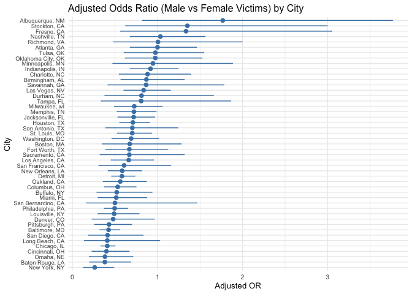

p8105_hw6_hy2958
================
2025-11-30

``` r
library(tidyverse)
```

    ## ── Attaching core tidyverse packages ──────────────────────── tidyverse 2.0.0 ──
    ## ✔ dplyr     1.1.4     ✔ readr     2.1.5
    ## ✔ forcats   1.0.0     ✔ stringr   1.5.1
    ## ✔ ggplot2   3.5.2     ✔ tibble    3.3.0
    ## ✔ lubridate 1.9.4     ✔ tidyr     1.3.1
    ## ✔ purrr     1.1.0     
    ## ── Conflicts ────────────────────────────────────────── tidyverse_conflicts() ──
    ## ✖ dplyr::filter() masks stats::filter()
    ## ✖ dplyr::lag()    masks stats::lag()
    ## ℹ Use the conflicted package (<http://conflicted.r-lib.org/>) to force all conflicts to become errors

``` r
library(ggplot2)
```

``` r
homicide = read_csv("./homicide-data.csv") %>% 
  mutate(city_state = str_c(city, ", ", state)) %>% 
  mutate(resolved = if_else(disposition == "Closed by arrest", 1, 0)) %>% 
  filter(!city_state %in% c("Dallas, TX",
  "Phoenix, AZ",
  "Kansas City, MO",
  "Tulsa, AL")) %>%
  filter(victim_race %in% c("White", "Black")) %>% 
  mutate(victim_age = as.numeric(victim_age)) %>% 
  filter(
    !is.na(victim_age),
    !is.na(victim_sex),
    !is.na(victim_race)) 
```

    ## Rows: 52179 Columns: 12
    ## ── Column specification ────────────────────────────────────────────────────────
    ## Delimiter: ","
    ## chr (9): uid, victim_last, victim_first, victim_race, victim_age, victim_sex...
    ## dbl (3): reported_date, lat, lon
    ## 
    ## ℹ Use `spec()` to retrieve the full column specification for this data.
    ## ℹ Specify the column types or set `show_col_types = FALSE` to quiet this message.

    ## Warning: There was 1 warning in `mutate()`.
    ## ℹ In argument: `victim_age = as.numeric(victim_age)`.
    ## Caused by warning:
    ## ! NAs introduced by coercion

``` r
#problem 1.1
baltimore <- homicide %>% 
  filter(city_state == "Baltimore, MD")

fit_baltimore <- glm(
resolved ~ victim_age + victim_sex + victim_race,
data = baltimore, family = binomial()
) %>% 
  broom::tidy(conf.int = TRUE)


fit_baltimore %>%
filter(term == "victim_sexMale") %>%
select(term, estimate, conf.low, conf.high) %>% 
knitr::kable()
```

| term           |   estimate |  conf.low |  conf.high |
|:---------------|-----------:|----------:|-----------:|
| victim_sexMale | -0.8544628 | -1.126423 | -0.5842017 |

``` r
#1.2

  
safe_glm <- purrr::possibly(
  function(df)
    glm(resolved ~ victim_age + victim_sex + victim_race,
        data = df, family = binomial()),
  otherwise = NULL
)

safe_tidy <- function(model) {
  if (is.null(model)) {
    return(tibble(
      term = character(),
      estimate = numeric(),
      conf.low = numeric(),
      conf.high = numeric()
    ))
  } else {
    return(
      broom::tidy(model, conf.int = TRUE, exponentiate = TRUE)
    )
  }
}

city <- homicide %>%
  group_by(city_state) %>%
  nest() %>%
  mutate(
    model = map(data, safe_glm),
    tidy_model = map(model, safe_tidy)
  )
```

    ## Warning: There were 43 warnings in `mutate()`.
    ## The first warning was:
    ## ℹ In argument: `tidy_model = map(model, safe_tidy)`.
    ## ℹ In group 1: `city_state = "Albuquerque, NM"`.
    ## Caused by warning:
    ## ! glm.fit: fitted probabilities numerically 0 or 1 occurred
    ## ℹ Run `dplyr::last_dplyr_warnings()` to see the 42 remaining warnings.

``` r
or_ci_city <- city %>%
  select(city_state, tidy_model) %>%
  unnest(tidy_model) %>%
  filter(term == "victim_sexMale") %>% 
  select(city_state, estimate, conf.low, conf.high) %>%
  arrange(estimate) 

  knitr::kable(or_ci_city)
```

| city_state         |  estimate |  conf.low | conf.high |
|:-------------------|----------:|----------:|----------:|
| New York, NY       | 0.2623978 | 0.1327512 | 0.4850117 |
| Baton Rouge, LA    | 0.3814393 | 0.2043481 | 0.6836343 |
| Omaha, NE          | 0.3824861 | 0.1988357 | 0.7109316 |
| Cincinnati, OH     | 0.3998277 | 0.2313767 | 0.6670456 |
| Chicago, IL        | 0.4100982 | 0.3361233 | 0.5008546 |
| Long Beach, CA     | 0.4102163 | 0.1427304 | 1.0241775 |
| San Diego, CA      | 0.4130248 | 0.1913527 | 0.8301847 |
| Baltimore, MD      | 0.4255117 | 0.3241908 | 0.5575508 |
| Pittsburgh, PA     | 0.4307528 | 0.2626022 | 0.6955518 |
| Denver, CO         | 0.4790620 | 0.2327380 | 0.9624974 |
| Louisville, KY     | 0.4905546 | 0.3014879 | 0.7836391 |
| Philadelphia, PA   | 0.4962756 | 0.3760120 | 0.6498797 |
| San Bernardino, CA | 0.5003444 | 0.1655367 | 1.4623977 |
| Miami, FL          | 0.5152379 | 0.3040214 | 0.8734480 |
| Buffalo, NY        | 0.5205704 | 0.2884416 | 0.9358300 |
| Columbus, OH       | 0.5324845 | 0.3770457 | 0.7479124 |
| Oakland, CA        | 0.5630819 | 0.3637421 | 0.8671086 |
| Detroit, MI        | 0.5823472 | 0.4619454 | 0.7335458 |
| New Orleans, LA    | 0.5849373 | 0.4218807 | 0.8121787 |
| San Francisco, CA  | 0.6075362 | 0.3116925 | 1.1551470 |
| Los Angeles, CA    | 0.6618816 | 0.4565014 | 0.9541036 |
| Sacramento, CA     | 0.6688418 | 0.3262733 | 1.3143888 |
| Fort Worth, TX     | 0.6689803 | 0.3935128 | 1.1211603 |
| Boston, MA         | 0.6739912 | 0.3534469 | 1.2768225 |
| Washington, DC     | 0.6901713 | 0.4653608 | 1.0122516 |
| St. Louis, MO      | 0.7031665 | 0.5298505 | 0.9319005 |
| San Antonio, TX    | 0.7046200 | 0.3928179 | 1.2382509 |
| Houston, TX        | 0.7110264 | 0.5569844 | 0.9057376 |
| Jacksonville, FL   | 0.7198144 | 0.5359236 | 0.9650986 |
| Memphis, TN        | 0.7232194 | 0.5261210 | 0.9835973 |
| Milwaukee, wI      | 0.7271327 | 0.4951325 | 1.0542297 |
| Tampa, FL          | 0.8077029 | 0.3395253 | 1.8598834 |
| Durham, NC         | 0.8123514 | 0.3824420 | 1.6580169 |
| Las Vegas, NV      | 0.8373078 | 0.6058830 | 1.1510854 |
| Savannah, GA       | 0.8669817 | 0.4185827 | 1.7802453 |
| Birmingham, AL     | 0.8700153 | 0.5713814 | 1.3138409 |
| Charlotte, NC      | 0.8838976 | 0.5507440 | 1.3905954 |
| Indianapolis, IN   | 0.9187284 | 0.6784616 | 1.2413059 |
| Minneapolis, MN    | 0.9469587 | 0.4759016 | 1.8809745 |
| Oklahoma City, OK  | 0.9740747 | 0.6228507 | 1.5199721 |
| Tulsa, OK          | 0.9757694 | 0.6090664 | 1.5439356 |
| Atlanta, GA        | 1.0000771 | 0.6803477 | 1.4582575 |
| Richmond, VA       | 1.0060520 | 0.4834671 | 1.9936248 |
| Nashville, TN      | 1.0342379 | 0.6807452 | 1.5559966 |
| Fresno, CA         | 1.3351647 | 0.5672553 | 3.0475080 |
| Stockton, CA       | 1.3517273 | 0.6256427 | 2.9941299 |
| Albuquerque, NM    | 1.7674995 | 0.8247081 | 3.7618600 |

``` r
ggplot(or_ci_city, 
       aes(x = reorder(city_state, estimate), y = estimate)) +
  geom_point(size = 2, color = "steelblue") +
  geom_errorbar(aes(ymin = conf.low, ymax = conf.high),
                width = 0.15, color = "steelblue") +
  coord_flip() +
  labs(
    title = "Adjusted Odds Ratio (Male vs Female Victims) by City",
    x = "City",
    y = "Adjusted OR"
  ) +
  theme_minimal(base_size = 10) +
  theme(
    axis.text.y = element_text(size = 7),  
    plot.title  = element_text(size = 12)
  )
```

<!-- --> The
plot shows substantial variation across cities in the adjusted odds
ratio (OR) comparing the probability of solving homicides involving male
versus female victims. In most cities, the OR is below 1, indicating
that cases with male victims are less likely to be solved than those
with female victims after adjusting for age and race. A few cities show
ORs close to or above 1, but many of these have wide confidence
intervals, suggesting limited precision. Overall, the results highlight
consistent disparities in homicide resolution associated with victim sex
across major U.S. cities.
